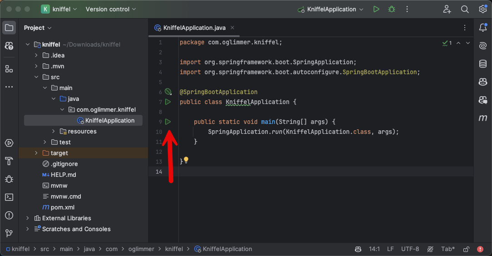
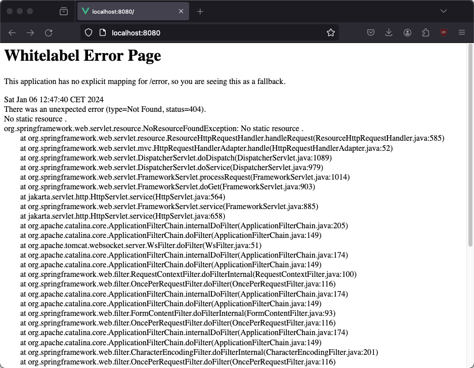

# Chapter 01

## Goal

You have a running REST API - without functionality but it returns http responses.

## Step 1 - generate base project

* all Spring projects starts at https://start.spring.io/ - so you have to go there and create a basic project. the following sections will help you to make the right choices before you click Generate.

### how to build a project

* java projects are either build with "maven" or "gradle"
* maven is XML based and simple
* gradle is groovy/kotlin based and more sophisticated (but more difficult to use)

### language

* Spring boot can be wirtten in Java, Kotlin or Groovy
* Java should be the default unless you have a good reason to use Kotlin (really nobody uses Groovy)

### Version

* Always go for the latest stable version

### Project metadata

* All Java projects (maven & gradle) need to have `group`. this is your reversed domain if you have a domain or your discord name. at the end it needs to make your project namespace unique. I always use com.oglimmer for my projects
* `Artifact` is your project name. for this should be kniffel.
* `Name` is your project name again. for this should be kniffel.
* `Package name` is again your group + artifact, so for me it is "com.oglimmer.kniffel" for this project.
* `Packaging` keep jar. Nobody uses war anymore.
* `Java` - up to you feel free to be frisky and go for the latest version.

Why is there ...

* group + artifact -> this is the name for "software package" living in a central repository (like https://mvnrepository.com/)
* package name -> this is the java package namespace

### Dependencies

Here it gets as complicated as you want ;)

Java and Spring Boot is made for enterprise applications - therefore it supports "everything".

We only need 3 dependencies for now:

* Spring Boot DevTools
* Lombok
* Spring Web

#### Spring Boot DevTools

it make development easier with "auto reload during dev time".

#### Lombok

this reduces the code you have to write massively. the lib provides java annotations so you don't have to type a lot of code. I think you should use.

#### spring Web

this dependency makes this project a REST API. without it, it is just a useless java program doing nothing at all.

## Step 2 - open in IDE and start the REST API server 

Click "generate" on https://start.spring.io/, download the zip, unzip and open in IntelliJ or VS Code.

Open src/main/java/your-package-names/.../.../KniffelApplication.java

This should compile and you don't see any errors.

Let's start the "Java Spring Boot Application" and see if it starts without errors.

### starting in intellij

You can run the program with one of the play icons, always use "debug"



### starting in vscode

Make sure you have all the vscode plugins for java, maven (or gradle) installed. this https://marketplace.visualstudio.com/items?itemName=vscjava.vscode-java-pack is a good start.

You can run the program with "debug" : 


### starting on command line

this is easy, but you won't have a debugger attached, so I would not recommend it for development. but I think it's good to know how to start a Spring application via terminal.

```bash
./mvnw spring-boot:run
```

### After started ....

After you have started the program it should look like this:


To test if the REST API is listening:

Open with a browser: http://localhost:8080 and you should see:



The error is ok, as we haven't added any content or endpoints.

## Step 3 - ways to test a REST API ...

### the browser

any GET request can be tested with a browser - as we did above.

but you cannot easily test a POST, PUT, PATCH or DELETE request, so browser testing is not really ideal.

### command line using curl

I am a fan of the terminal, so I like REST API testing vial curl

```bash
curl "http://localhost:8080/" -v
```

this should show a similar result as the browser. with curl we can also test any request method (POST, PUT, etc.) and we have full control over all headers or parameters in general. I will get back to curl.

### in the browser using Swagger / OpenAPI

we will set up the project in a way that itself offers a web page to test itself. this will look like this https://math.oglimmer.de/swagger/ui

### any other REST API testing applicatoin

There are many applications out there to test REST APIs. Maybe the most common one is https://www.postman.com/ - feel freel to check it out
